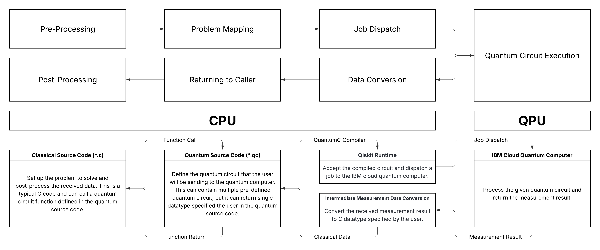

# QuantumC

## Project Description

**QuantumC** is a C99 compatible programming language designed for quantum computing, accompanied by a compiler that translates C code to OpenQASM.
As the [International Year of Quantum Science and Technology](https://quantum2025.org) unfolds, quantum computing and quantum information have seen remarkable breakthroughs.
Quantum computers are now more accessible than ever, enabling individuals with programming experience to execute quantum circuits on real quantum hardware and obtain results.

While Python’s straightforward syntax has made it the language of choice for many quantum computing tools (e.g., [Qiskit](https://www.ibm.com/quantum/qiskit) and [Cirq](https://quantumai.google/cirq)), optimal quantum speedup requires efficient post-processing of quantum data.
The lightweight nature of the C programming language, combined with its tenacious community, makes it an excellent candidate for circuit construction and classical post-processing.
The **QuantumC** project aims to demonstrate C's clarity as a quantum programming language.

### C and OpenQASM

Python is widely used for application development due to its easy learning curve, but its runtime performance can be dawdling, especially for iterative tasks.
As quantum hardware advances, the volume of classical data to process will increase, making performance a critical factor.
[OpenQASM](https://openqasm.com), managed by IBM, is an open-source quantum intermediate representation for describing quantum circuits.
Quantum hardware architectures vary, necessitating the compilation of theoretical circuits into machine-specific instructions. 
For instance, Hadamard gates $\mathrm{H}$ are converted as $\mathrm{R}_{\mathrm{X}}(\pi/2)\sqrt{\mathrm{X}}\mathrm{R}_{\mathrm{Z}}(\pi/2)$ in IBM Eagle r3 architecture.
OpenQASM provides a universal abstraction, enabling theoretical quantum algorithms to be compiled for diverse hardware.
**QuantumC** leverages the strengths of both C and OpenQASM to facilitate efficient quantum programming.

## Example

Consider the creation of a Bell state in an 8-qubit system, which demonstrates entanglement of eight qubits: $\ket{\Phi^+} = \frac{1}{\sqrt{2}}\ket{0}^{\otimes 8} + \frac{1}{\sqrt{2}}\ket{1}^{\otimes 8} = \frac{1}{\sqrt{2}}\ket{00000000} + \frac{1}{\sqrt{2}}\ket{11111111}$.
To generate this state, apply a Hadamard gate ($H$) to `qubit 0`, then apply a controlled-NOT gate ($\text{CNOT}$) with `qubit 0` as control and `qubit 1` as target.
Repeat locating controlled-NOT gates between successive qubits (for example, `qubit 1` as a control and `qubit 2` as a target) until `qubit 7`.
Finally, apply a measurement gate to every qubit to convert the quantum data into classical data for post-processing.
After this process, we obtain the following quantum circuit.

<div align='center'>


</div>

### QuantumC Example

```c
#include <inttypes.h>
#include <quantumc.h>

uint8_t eight_qubit_bell_state() {
    qubit q[8];

    apply_H(q[0]);
    for (int i = 0; i < 7; i++) {
        apply_CX(q[i], q[i+1]);
    }

    uint8_t meas = measure(uint8_t, q);

    // Expected to return 0b00000000 == 0 with a 50% probability and 0b11111111 == 255 with a 50% probability.
    return meas;
}
```

### OpenQASM Example

```qasm
OPENQASM 3;
include "stdgates.inc";

qubit[8] q;

h q[0];
cnot q[0], q[1];
cnot q[1], q[2];
cnot q[2], q[3];
cnot q[3], q[4];
cnot q[4], q[5];
cnot q[5], q[6];
cnot q[6], q[7];

bit[8] meas;
meas = measure q;
```

## Workflow

<div align='center'>



</div>
The general workflow of QuantumC is shown in the diagram above: write a QuantumC program, compile it with the frontend to produce OpenQASM, then run that OpenQASM code to a local simulator or a cloud quantum backend. 
The bottom path of the diagram illustrates the typical steps when targeting a provider such as IBM Cloud.

## Quick Start

*Documentation for setup and usage will be provided as the project evolves.*

## Directory Structure

* [`demos/`](./demos/): Contains the source code for demonstration.
* [`figures/`](./figures/): Contains the figures for the QuantumC documentation.
* [`specs/`](./specs/): Contains the specifications for the QuantumC language.
* [`src/`](./src/): Contains the source code for the QuantumC compiler.
* [`tests/`](./tests/): Contains the testing cases for the QuantumC compiler.
* [`utils/`](./utils/): Contains the utility scripts.

## Compilation

### Required Tools

This project is built with GCC and make and uses flex and bison to generate the lexer and parser.
You will need a POSIX-like environment (Linux or Windows Subsystem for Linux) with the following tools installed:
* `gcc` (C compiler), 
* `make` (building tool), 
* `flex` (lexer generator), 
* `bison` (parser generator), and 
* `libcurl4-openssl-dev` ().

### Recommended Installation Commands by Platforms

* Debian / Ubuntu:
```bash
sudo apt update && sudo apt upgrade -y
sudo apt install -y build-essential flex bison libcurl4-openssl-dev
```
Note: The package `build-essential` includes `gcc`, `make`, and other basic build tools.

* Fedora / RHEL (DNF):
```bash
sudo dnf install -y gcc make flex bison libcurl4-openssl-dev
```
* Windows: use WSL (recommended) or an MSYS2 environment. In WSL (Ubuntu) run the Debian/Ubuntu commands above. If using native Windows toolchains, ensure `flex`/`bison` are available (MSYS2 packages or binaries).

### Building Steps

1. Open a terminal in the project root or the frontend directory `compiler/src/fe`.
2. Run `make` (the default target produces the `main` executable):
```bash
make
```
3. To remove generated files and object files:
```bash
make clean
```

### Troubleshooting

* If `make` fails with `bison: command not found` or `flex: command not found`, install those packages or run the build in WSL/macOS where the tools are available.
* If you see undefined reference errors at link time, check whether any required libraries are missing or whether object files failed to compile earlier in the output.

## Contribution

Before making any contributions, please refer to the [contributing](./CONTRIBUTING.md) documentation.

## License

MIT License.
